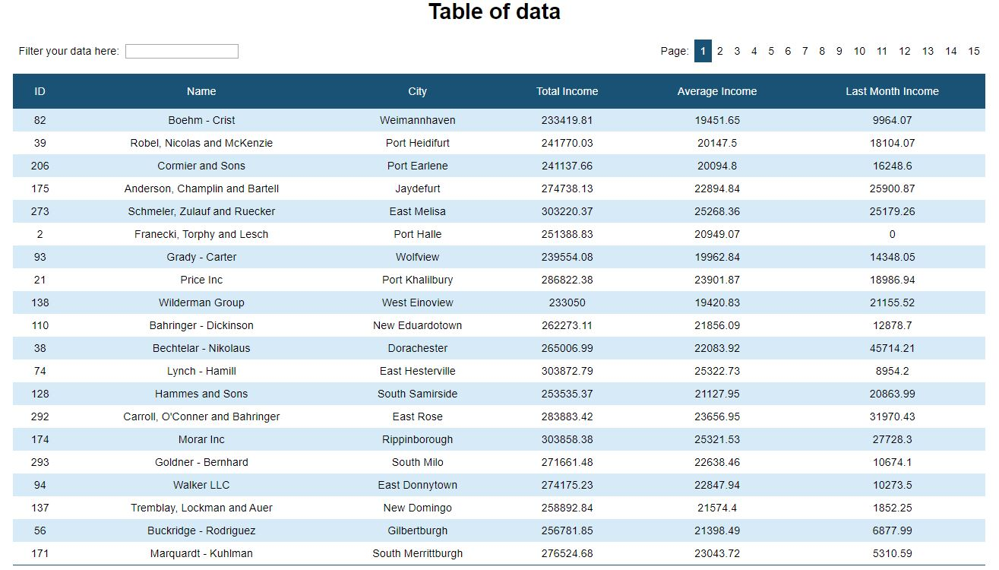

## Table of contents
* [General info](#general-info)
* [Live demo](#live demo)
* [Technologies](#technologies)
* [Features](#features)
* [Setup](#setup)
* [Sources](#sources)

## General info
This project builds table for companies data, including: company id, name, city, total income, average income and last month income. 

## Live demo 
You can find this project here: https://sylwiasuwalska.github.io/table-for-companies/ 



## Technologies
Project is created using:
* ReactJS 16.13.1 with Hooks
* axios
* npm

## Features
* displaying data fetched from APIs
* sorting by ascending or descending order after click on header by given column with indicators of sort order
* filtering by all fields of table
* responsive layout for comfortable viewing from smaller devices
* pagination
	
## Setup
To run this project, install it locally using npm:

```
# Clone this repository
$ git clone https://github.com/sylwiasuwalska/table-for-companies

# Go into the repository directory

# Install dependencies
$ npm install

# Run the app
$ npm start
```

## Sources
* loading spinner comes from https://loading.io/

